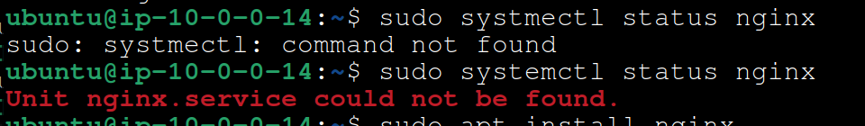
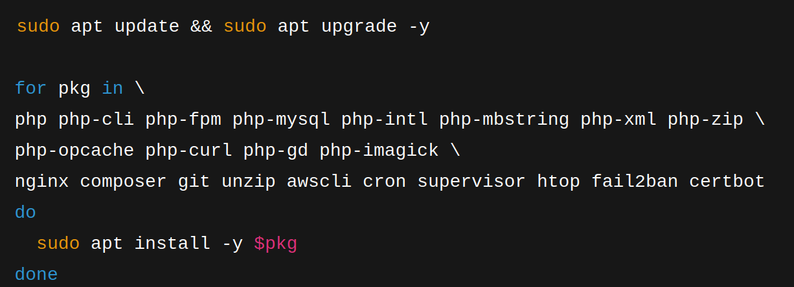
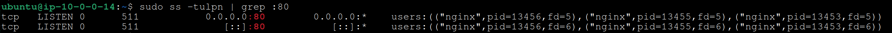

## Deploiement of the application on classic EC2

# AWS VPC – Architecture multi-AZ

## 🎯 Objectif
Deployer une application dans une architecture classique : 
- [x] 2 instances EC2 dans 2 AZs pour la haute disponiblité
- [x] Internet Gateway pour l'accès internet
- [x] 1 ELB (Elastic Load Balancing) pour gere le trafique
- [x] 1 RDS a base MSQL pour la gestion de la base de donnée
- [x] IAM Role : EC2 pour accès s3 et RDS de l'instance EC2
- [x] Security Groupe pour autoriser HTTP, SSH(administration), Mysql

## 🏗️ Architecture

## 🛠️ Difficultés rencontrées
- Site inaccessible après avoir parametré IGW, Route table, Security groups
==> Investigation faite via l'instance EC2 local via ssh
    systemctl status nginx => 
    

    Reinstallation propre des package nécessaire 
    

==> Curl local en session ssh : curl http://localhost : resulta correct ✅ mais toujours pas de reponse via le navigateur

- Verification nginx et les ports ecoutés :  sudo ss -tulpn | grep :80 
==> Le port 80 est bien en ecoute depuis n'importe quelle source

   

- ping de l'ip publique depuis ma machine distant : KO
- curl -v http://16.171.62.43 : OK ✅
- Erreur : j'ai executé le test directement 16.171.62.43 et le protocole par défaut du navigateur était https , il suffisait juste ecrire correcte http://16.171.62.43

## ✅ Acquis

## 📄 Détails techniques
