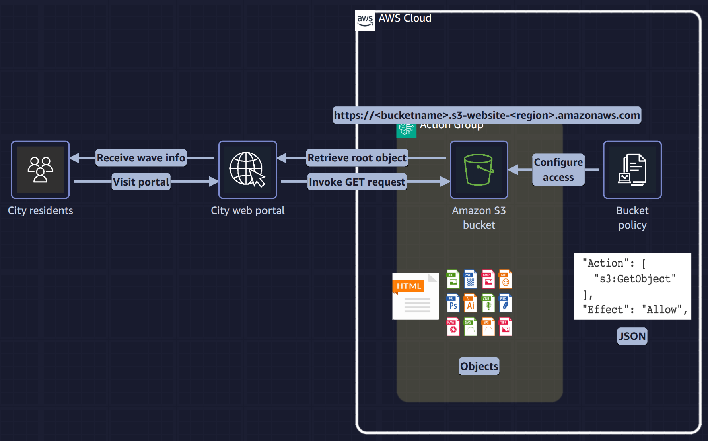

## SimulLearn hosting static website on s3 bucket

In this practice lab, I'm hosting a static website on s3 bucket. 

# Goals : 
- [x] Review a bucket policy to secure a bucket in Amazon S3.
- [x] Enable static website hosting

# Presentation en image du labs

- Enable static website hosting on an Amazon S3 bucket.
- Review the bucket policy to secure the hosting bucket.

# Difficulty encoutered
- Understand the key-word of Buket policy
- With mor practice, any key-word are repeated and it help me to remind myself the good terms with time

# Summary

-This time for hands on lab maked me understand that hosting static website on s3 buckue is easier than I thinked it. 
Now I'm able te do it again during less time and secure access. 

# Areas for improuvement

- Securing content in transit (for now, when I tried to acces to the website, the communication iis not secure). So I will implment it on the next update with SSL / TLS encryption. 